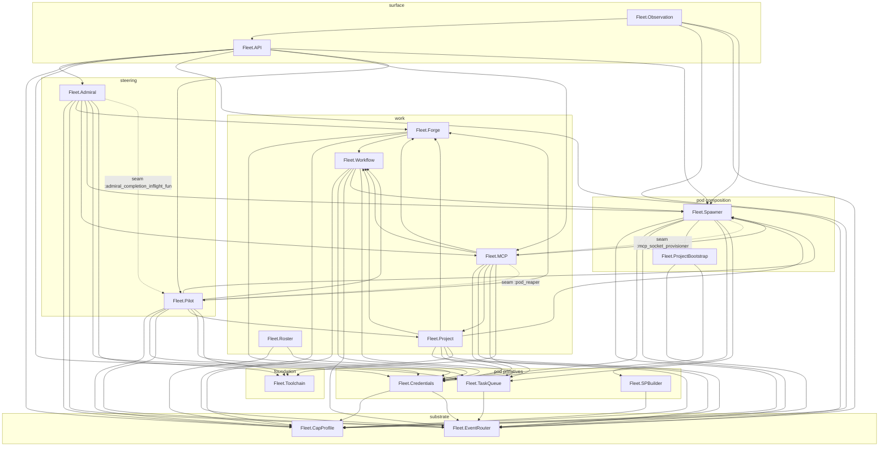

# LCARS Fleet Runtime

**Date** : 2026-05-09
**Dernière révision** : 2026-08-11
**Statut** : runtime — app OTP unique `:lcars_fleet`, frontières vérifiées à la compilation (`boundary`)
**Référencé par** : `lib/fleet/README.md` (la carte racine renvoie ici pour le diagramme)

Plan de contrôle OTP pour une flotte d'agents LLM faillibles. Le runtime *spawn*, surveille et
récolte des pods éphémères (un agent par rôle, sandboxé), et fait avancer le travail sur une forge
Git — **la forge EST la machine à états** : l'état vit dans les issues/PR/labels, pas en RAM. Un pod
qui meurt, un run raté, un crash du nœud ne perdent rien de porteur — la forge reste la vérité, la
tâche non signée re-dispatche. Le Bus (`Phoenix.PubSub`) est un fast-path *lossy* assumé, jamais une
source de vérité.

Implémentation Elixir/OTP. Les frontières inter-domaines sont **compilées** par `boundary` (le graphe
de dépendances est vérifié à la compilation, pas tenu par discipline) ; `mix gate` vert = compile strict
+ suite ExUnit + tests hors-mix (shell_gate) + contrats inter-modules + fraîcheur topologie + Dialyzer strict.

## Architecture — un graphe de dépendances vérifié à la compilation

Le runtime est **une seule** app OTP. Ses ex-apps umbrella sont devenues des *domaines*, étagés
par leur graphe de dépendances compilé. La règle est mécanique, pas disciplinaire : une dépendance
va vers le **bas**, jamais vers le haut. La librairie
[`boundary`](https://hex.pm/packages/boundary) l'impose **à la compilation** — une arête montante
interdite casse le build, pas une revue de code. La carte canonique des couches est GÉNÉRÉE depuis
ces déclarations (`mix lcars.topology`, vérifiée par le gate) : la table vit dans
`lib/fleet/README.md`, le diagramme ci-dessous est l'autre sortie du même calcul.

<!-- boundary-topology:begin (generated by `mix lcars.topology` — do not edit by hand) -->


*(Generated by `mix lcars.topology` from the `use Boundary` declarations — the gate
refuses divergence. Omitted for readability: the foundation utilities (`deps: []`: `Fleet.BootGuard`, `Fleet.Catalogue`, `Fleet.Conflict`, `Fleet.DurableLog`, `Fleet.EnvParse`, `Fleet.Event`, `Fleet.FindingsWire`, `Fleet.GitRef`, `Fleet.Grace`, `Fleet.Labels`, `Fleet.Layout`, `Fleet.Opts`, `Fleet.PeriodicCheck`, `Fleet.PodId`, `Fleet.Publish.InFlight`, `Fleet.ReceptionFilter`, `Fleet.ReleaseDoor`, `Fleet.SchemaCache`, `Fleet.Shutdown.Quiesce`, `Fleet.Slug`, `Fleet.SystemConfig`), which every domain may depend down on, and the OTP root `Fleet.Application`,
which starts every domain. Dotted = runtime seams, config-injected — deliberately
invisible to the compiler, cf. `CLAUDE.md`. The full layered table lives in
`lib/fleet/README.md`.)*
<!-- boundary-topology:end -->

Deux besoins *montants* existent (`spawner → mcp` pour provisionner la socket MCP du pod ;
`mcp → pilot` pour le onboarding forge). Ce ne sont **pas** des dépendances compile : ils passent par
un **dispatch dynamique injecté au runtime** (module résolu par config, appelé via une variable). Le
graphe boundary le prouve — `Fleet.Spawner` n'a aucune arête vers `Fleet.MCP`, `Fleet.MCP` aucune
vers `Fleet.Pilot`. Le compilateur refuserait l'alias compile-time ; le seam reste explicite et
testable.

Le graphe complet des frontières est régénérable :

```bash
mix boundary.visualize   # → boundary/app.dot (graphviz)
```

### Frontières vendor (N0 / N1)

Tout ce qui parle à un vendor précis (Claude SDK) est **N1**, isolé derrière un launcher shell
(`bin/claude_launch.sh`). Le reste est **N0**, vendor-agnostic. Un pod tourne sandboxé (`bwrap`,
mounts RO + tmpfs `/home` + bind credentials) ou host-native selon son cap-profile. Nouveau vendor →
nouveau `bin/<vendor>_launch.sh`, même forme d'arguments ; aucun flag vendor ne fuite en N0.

## Le gate

`mix gate` est le verrou unique — CI et pré-push jouent la même chose :

```
mix gate
├─ compile --warnings-as-errors   # + le compilateur boundary (arêtes montantes = build cassé)
├─ test                            # ExUnit — baseline hermétique (REST Plug.Test, spawn StubBackend) ; les tests transport/launcher ouvrent de vraies sockets/pods
├─ tests hors-mix                  # bridge MCP stdio (python) + tests bats des launchers (bwrap/claude)
├─ lcars.contracts.check          # contrats inter-modules — 75 murs à cliquet
├─ lcars.topology --check         # fraîcheur de la carte générée (lib/fleet/README.md ≡ use Boundary)
└─ dialyzer                        # strict (unmatched_returns, error_handling, extra_return…)
```

`lcars.contracts.check` mérite un mot : chaque contrat qui a un jour dérivé (un consumer resté sur
l'ancien format d'event, un handler fantôme, une frontière wire cassée) devient un **check mécanique**
qui relit le vrai code (grep/introspection) et refuse le build s'il rouvre. Une invariant promue de
« fermeture documentaire » à « fermeture mécanique » : un agent qui re-dérive casse le gate.

## Build / run

```bash
mix deps.get
mix compile --warnings-as-errors
mix test

MIX_ENV=prod mix release        # → _build/prod/rel/lcars_fleet (self-contained, ERTS bundlé)
```

Le runtime est lancé **par un humain** via `bin/fleet` (pas de `systemd User=lcars` : l'humain
lance sa flotte, les pods héritent son UID). La procédure deploy/run et le catalogue d'env vars sont
dans `etc/README.md` + `etc/fleet.env.template`.

## Où lire la suite

- **`CLAUDE.md`** — guide de navigation du dépôt : topologie, invariants, conventions.
- **Contrat d'un domaine** — le `@moduledoc` de sa façade `Fleet.<Domaine>` (SSoT machine-visible :). Les `README.md` des domaines sont des **cartes** (index de modules + pointeurs),
  jamais une copie du contrat.
